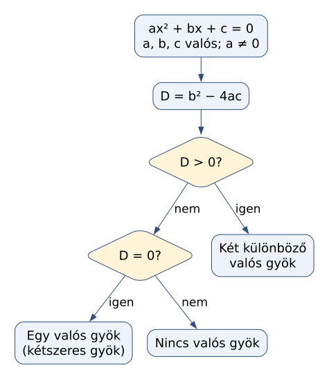
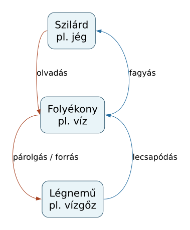
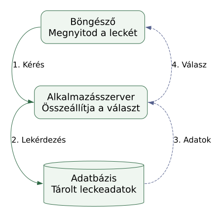
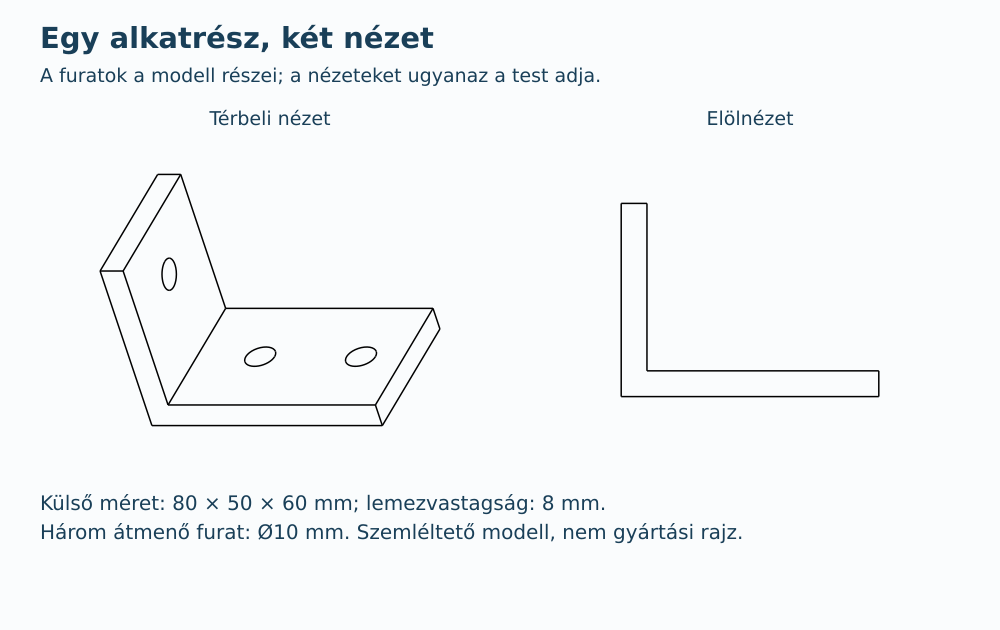
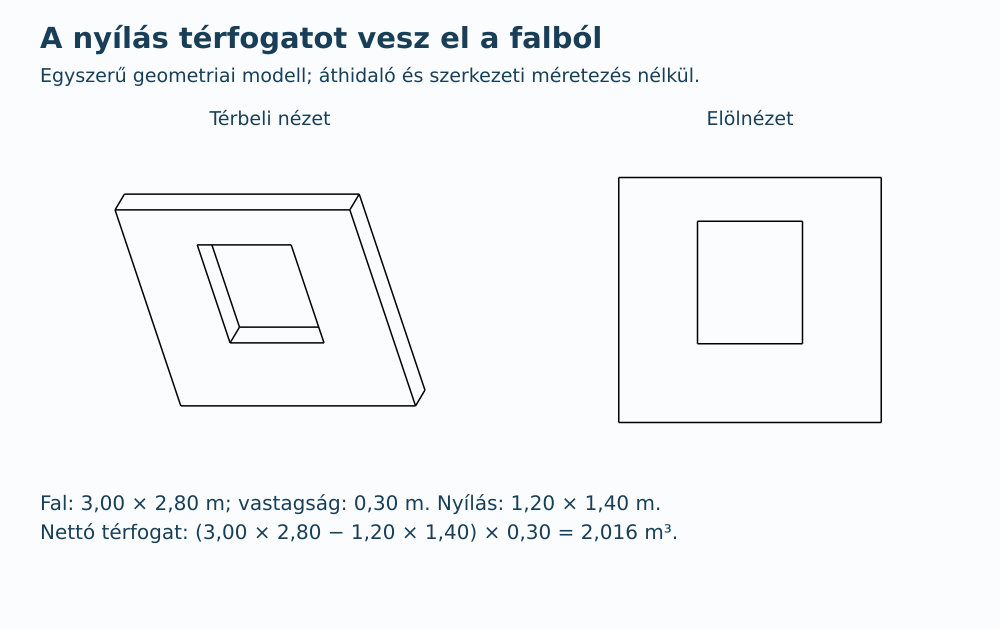
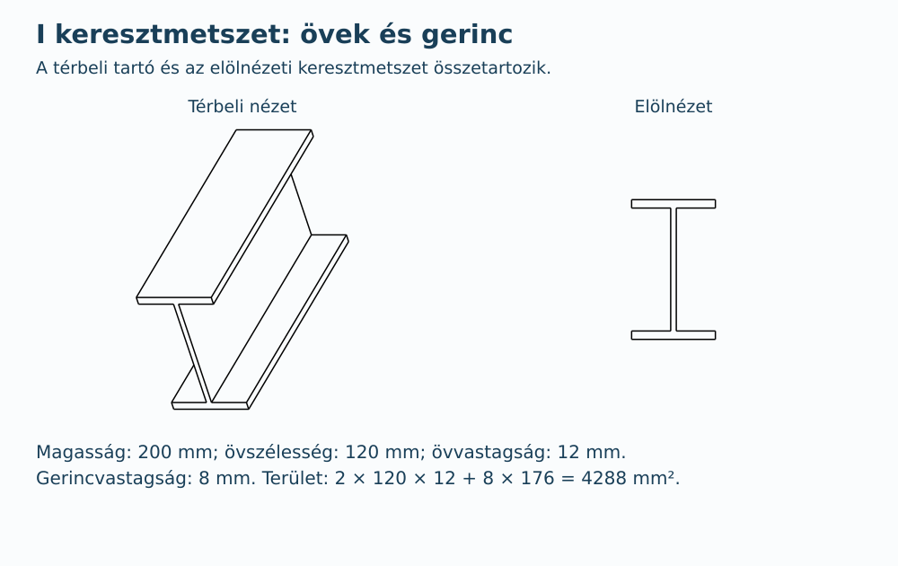
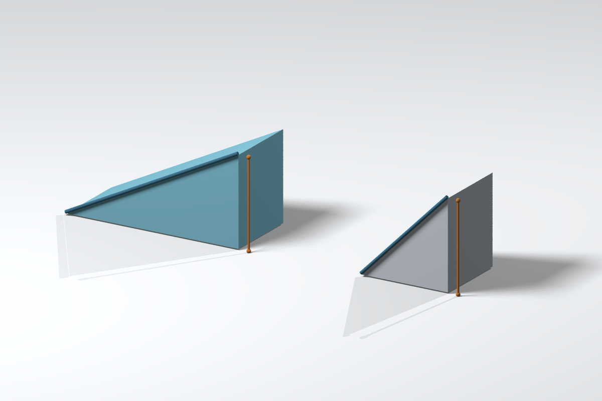
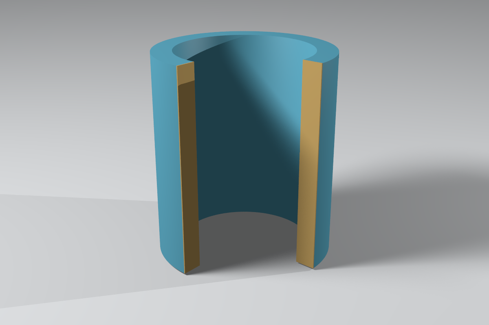
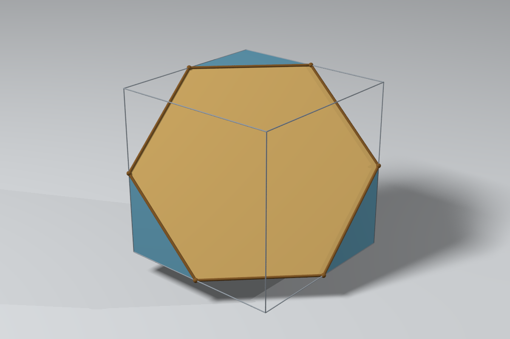

# Kilenc további műszaki ábraminta

A teljes magyar magyarázatot a [helyi galériában](more.html) találod. A HTML-t a Git-checkoutból böngészőben nyisd meg; a GitHub a forrását mutatja. Az alábbi képek itt a GitHubon is megjelennek. A képre kattintva nagyíthatsz.

Ez a második sorozat még felhasználói megtekintésre és visszajelzésre vár. Az első három mintára kapott pozitív visszajelzés nem fogadja el automatikusan ezeket. A bemutatók nem kerültek be a tanulói jegyzetekbe.

## G1. Másodfokú egyenlet: döntési fa



A diszkrimináns előjeléből állapítjuk meg a különböző valós gyökök számát. A feltétel: valós együtthatók és a ≠ 0; a rajz nem számolja ki a gyökök értékét.

## G2. Halmazállapot-változások: ellentétes irányok



Az olvadás/fagyás és a párolgás vagy forrás/lecsapódás irányait mutatja. A közvetlen szilárd-gáz átalakulások nem szerepelnek, ezért ez nem teljes állapottérkép.

## G3. Webalkalmazás: kérés és válasz



Egy adatbázist használó webalkalmazás példája; nem a jegyzetoldalak tényleges rendszerrajza. A folytonos nyíl a kérést, a szaggatott a visszatérő adatot/választ jelöli.

## C1. Konzol: egy test két nézete



A talp két és a függőleges rész egy furata ténylegesen kivont térfogat. Az elölnézet csak a látható kontúrt mutatja, takart furatélek nélkül. Nem gyártási dokumentáció.

## C2. Falrész: nyílás és nettó térfogat



A teljes fal térfogatából kivonjuk az átmenő nyílást: 2,016 m³ marad. Geometriai példa, nem áthidaló- vagy szerkezeti méretezés és nem szabványos anyagjelölési minta.

## C3. I szelvény: keresztmetszet és terület



Két öv és a köztük maradó gerinc: 2 × 120 × 12 + 8 × 176 = 4288 mm². Ideális éles sarkú keresztmetszet, nem szabványos hengerelt szelvény.

## P1. Két térbeli lejtő



Mindkét rámpa magassága 1,50 m. A 3,00 m és 1,50 m vízszintes kiterjedéshez kb. 3,35 m és 2,12 m hosszú lejtő tartozik. Közös párhuzamos vetület, nem erő- vagy mozgásszimuláció.

## P2. Cső: kivágás és falvastagság



Egy negyed eltávolítása láthatóvá teszi a belső palástot. A falvastagság a külső és belső sugár különbsége: 1,30 − 1,00 = 0,30 egység. A sárga vágott felület magyarázó szín.

## P3. Kocka: hatszög alakú síkmetszet



A kocka közepén átmenő x + y − z = 0 sík hat élfelező pontot köt össze. A modellben szabályos hatszög; perspektívában az egyenlő oldalak nem látszanak egyenlőnek. A szürke élváz a levágás előtti teljes kockát mutatja.

## Mérés és ellenőrzés

Az első sorozattal azonos helyi CPU-n, már rendelkezésre álló ideiglenes programcsomagokkal; új telepítés, kiegészítő, Hermes-módosítás és fizetős API-hívás nélkül. Ez egyszeri futás példánként, nem többismétléses teljesítményteszt.

| Feladat | Teljes folyamat ideje |
|---|---|
| quadratic | 0.020 s |
| phases | 0.024 s |
| web-request | 0.033 s |
| cad | 0.235 s |
| ramps | 2.850 s |
| pipe-cutaway | 3.717 s |
| cube-section | 3.769 s |

A `cad` sor együtt tartalmazza a három modell létrehozását, ellenőrzését, FCStd/STEP mentését és két-két TechDraw-vetületét. A POV-Ray képek 1200 × 800 képpontosak, két CPU-szállal, Q9 és AA 0,1 beállítással készültek. A források és a részletes gépi ellenőrzés hashét a [mérési rekord](preview/more-checks.json) őrzi.

* Graphviz: minden előírt él és iránya megvan az SVG-ben; a feliratokat, feltételeket és kapcsolódásokat közvetlen megtekintéssel is ellenőriztük.
* FreeCAD: egy-egy érvényes test, analitikus térfogategyezés, a furat/nyílás helyének és megmaradó anyagnak ellenőrzése; a konzol és I szelvény megadott külső méretei. A vetületeknél külön javítottuk a tájolást és a végső vonalvastagságot.
* POV-Ray: a jelenetek deklarált méretei és a megjelenített szerkezet ellenőrizve. A kockametszet hat, ténylegesen kibocsátott pontján síkbeli elhelyezkedés, élfelező helyzet, egyenlő oldal és 120°-os szög ellenőrzése történt. Nincs fizikai szimuláció vagy gyártási/építési megfelelőségi igazolás.

## Újrafuttatás

A [more.py](more.py) csak a megadott programokat futtatja, nem telepít. Új, repón kívüli kimeneti könyvtár szükséges:

```sh
python3 examples/technical-visuals/more.py --dot /path/to/dot --povray /path/to/povray --freecad-app-run /path/to/squashfs-root/AppRun --output /tmp/visual-nine-1
```

A FreeCAD-példák a [cad-more.py](cad-more.py) fájlban vannak; a `.dot` és `.pov` fájlok neve megfelel a képek nevének. Az összes saját forrás Gitben van; a programcsomagok és nagyobb natív kimenetek nem a repó részei. A korábbi [helyi előkészítés](README.md#runtime-preparation-used-for-this-experiment) változatlan.

## További szóba került eszközök

Az SVG, TikZ/PGF és Matplotlib is a vizsgált lehetőségek közé tartozik. Az SVG már használatban van a jegyzetekben. A TikZ/PGF precíz szerkesztett és szedett ábrákhoz, a Matplotlib függvényekhez és adatokhoz lehet hasznos; ebben a kilences körben ezekhez nem készült új próba, és nem telepítettünk hozzájuk csomagot.
