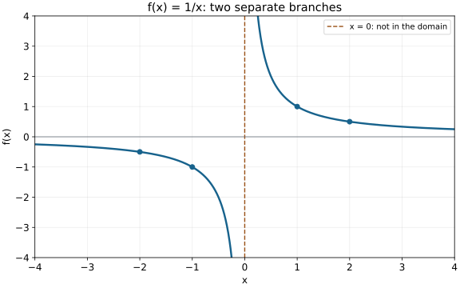
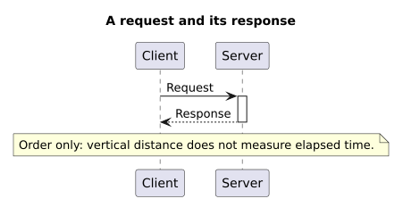
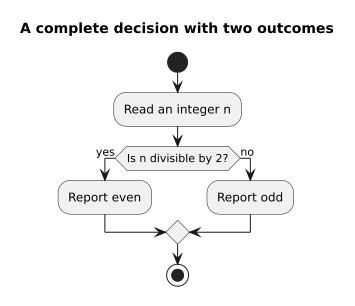
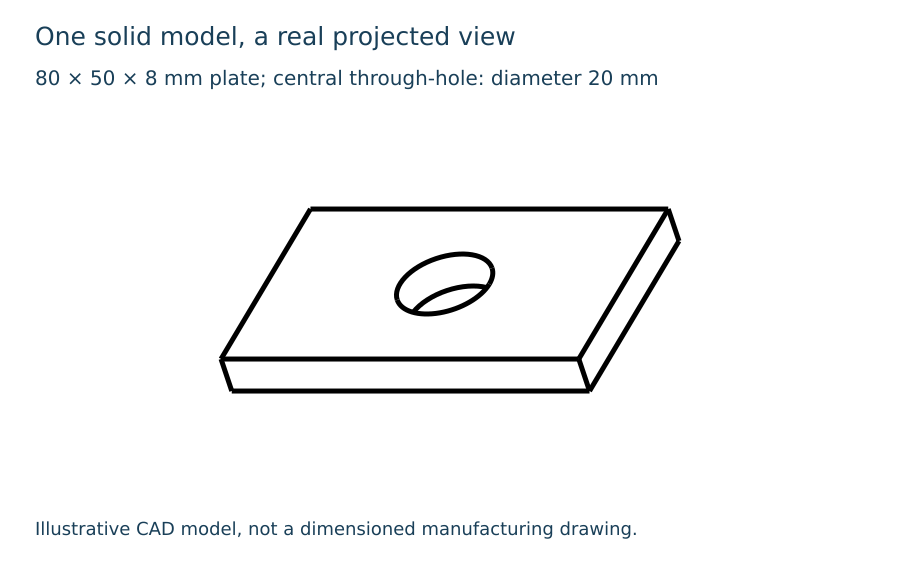

# Repository runner examples

These are tool-execution examples, not additions to a student's lesson. Rebuild them with the [documented commands](../../instructions/install-visual-tools.md#run-a-visual). The source remains editable and the programs are installed separately. No paid generator is used.

## Matplotlib: a domain matters

[Source](function-plot.py). Sampling stays in two separate domain intervals; the plot does not draw a false line through the discontinuity. Marked points satisfy `x * f(x) = 1`. The visible window clips the unbounded branches; it is not the full function range.

## PlantUML: order and decisions

[Source](message-sequence.puml). Solid request and dashed response have opposite directions. Vertical separation establishes order, not measured duration.

[Source](decision-activity.puml). Both outcomes are labeled, complete and rejoin. This checks a concrete activity diagram path, not every PlantUML family or local include.

## FreeCAD: a solid and its projection

[Source](plate-model.py). Built-in Part geometry and TechDraw projection, without an addon. The source checks a single valid solid, an empty bore center and the analytic volume `(80 * 50 - pi * 10^2) * 8` cubic millimeters. FCStd and STEP exports are expected outputs. The view is an illustration, not a fully dimensioned manufacturing drawing.

## What was checked

The new runner also executes the existing [Graphviz structure](structure.dot) and [POV-Ray cutaway](pipe-cutaway.pov). On the workstation, all six invocations completed and their final renderings were inspected. Nine execution-contract tests cover discovery without writes, configuration resolution, protected source paths, output preservation, reserved paths, missing outputs, nonzero exits, timeout and symlink rejection. These checks do not certify arbitrary future diagrams.

The [measurement record](preview/runner-checks.json) identifies the four new sources and their checked preview hashes. Timings are individual invocations, not benchmark medians or predictions for other machines. The larger old galleries have their own evidence and accepted human feedback.

**Human feedback on these four new examples is pending.** Creating or displaying a preview is not evidence that the user viewed or accepted it.
