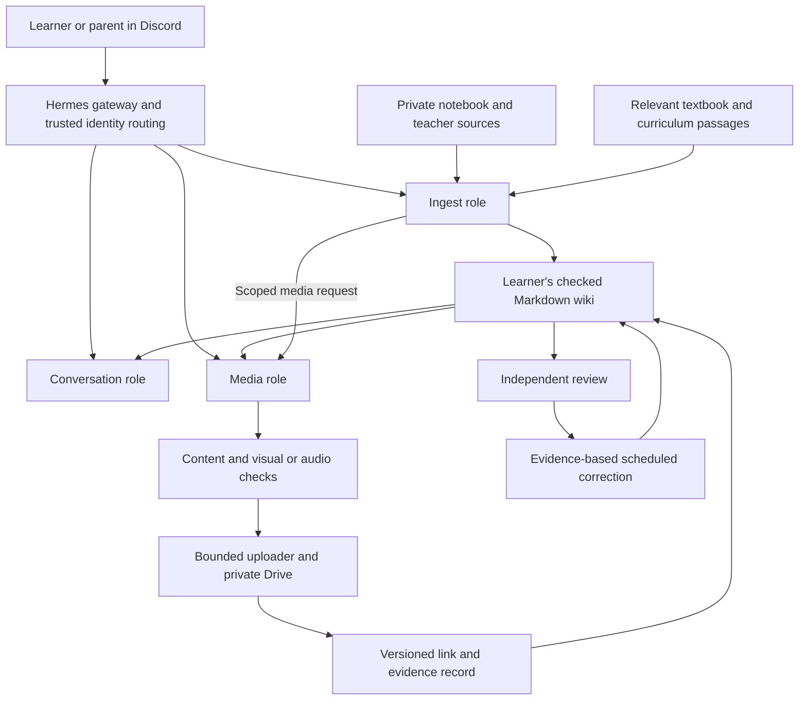

# School-learning system handbook

This handbook explains the complete solution: why its parts exist, how they work together, what is actually configured, how to operate it, and how to rebuild it. It supports learning, fact lookup, future blog writing and installation. It is not only a disaster-recovery runbook. Shared explanations live here; deployment-specific facts and evidence live in private records. Update both when installing or changing a component.

## Find the information you need

| Question | Starting point |
|---|---|
| How does the complete system work? | Architecture and lifecycle below |
| What do the bots do, and how are they routed? | [Hermes and bots](hermes-and-bots.md) |
| How does a notebook become a checked lesson? | AGENTS.md Sources, Visual evidence checks, Curriculum-aware learning and Workflows |
| What is common and what belongs to one learner? | [AGENTS.md](../AGENTS.md), [PROFILE.md](../PROFILE.md), [shared-files.json](../shared-files.json) |
| How do we make images, podcasts, slides and printable notes? | [Media workflows](media-workflows.md), [prompt stages](media-prompts.md), [handoff contract](media-handoff.md) |
| How does Drive authentication and upload work? | [Drive configuration and operations](install-drive.md) |
| How do we rebuild from zero? | [Installation sequence and inventory](install.md) |
| What was actually installed on our machine? | Private deployment inventory: versions, sanitized configuration, checks and dated change records |
| What can we safely turn into a blog post? | The publishing guidance below, backed by the private experiment records |

## Architecture and the reason for each boundary

This diagram describes the intended responsibilities, not proof that all separate bots are deployed. The wiki, source/evidence workflow, current shared Hermes bot and Drive uploader exist; separate role/learner executors and the complete media pipeline remain deployment stages. The private inventory supplies the exact status and verification date.

Markdown in Git provides reviewable changes, provenance and a readable learning resource. `sources/` preserves teaching evidence; `references/` supplies bounded checking context, including curriculum depth. The wiki distills and explains rather than publishing raw notebooks or textbooks. `AGENTS.md` is common operating policy, `PROFILE.md` holds confirmed learner settings, and adapters such as `CLAUDE.md` import those instructions. The common file manifest and checker prevent the same policy from quietly diverging between children and template.

Hermes connects conversations, models, skills and scheduled work. Discord channels determine who can speak and read; trusted numeric IDs determine routing. A bot name is not an authorization boundary. Separate memory, tools and filesystem access must be enforced for learner separation. Large media goes to private Drive to avoid bloating Git; compact provenance and links remain with the lesson. The uploader checks transfer integrity; the media workflow checks whether the artifact actually teaches the intended facts.

## Learning lifecycle

1. Identify the learner and current learning task from trusted context. The notebook/class material sets the lesson's core; curriculum references guide relevant depth rather than adding every available subject.
2. File and hash the source; inspect relevant images directly, including crop limitations and conversion metadata when present. Notebook order takes precedence; otherwise use textbook reference order. Keep an evidence record usable by the next reviewer.
3. Write connected explanations, examples and self-check questions, with visible distinctions between class content and additions. Maintain indexes, provenance and the operation log.
4. Select a visual by its teaching purpose: precise SVG/code for exact technical relationships; a checked generated infographic for a useful overview. A header is decoration, not evidence. Do not replace every SVG or generate paid batches automatically.
   History pages establish time and place in their opening; banner context is optional repetition. Before image generation, choose composition by the relationships being taught, compare an accepted relevant example, and separately check factual accuracy and visual explanation. See [media workflows](media-workflows.md#infographic).
5. For requested media, plan content and prerequisites before generation; check the result and repair only within configured attempt and cost limits. Infographics, presentations, podcasts and printable notes have different narrative structures.
6. Upload accepted artifacts to the recorded learner destination, verify bytes, establish intended-reader access, then publish the versioned link and evidence within the user's Git authorization.
7. Review against the same source versions and actual images/audio. Apply justified corrections, record disagreement or missing evidence, and flag affected derivatives for rechecking.

When asking for clarification or a decision, apply *Ask self-contained, useful questions* in [AGENTS.md](../AGENTS.md#workflows): supply the context, concrete problem, real alternatives if any, and a recommendation or next step. Keep confirmed facts separate from unknown expectations; reviewers use the same rule. Self-test solutions remain hidden until requested.

## Documentation contract for every change

For a completed step, record: purpose and alternatives; exact version; prerequisite; configuration key/path; installation or change command; resulting behavior; verification and limits; rollback; and links to dependent components. Record the date and whether a statement is observed, user-confirmed, inferred, proposed or unresolved. Never turn a plan into a claimed deployment just by copying it into a guide.

Keep one authoritative home for each fact. Shared mechanisms and generic configuration examples belong in the template and are synchronized through the manifest. Actual channel/folder/user IDs, machine paths, deployment receipts and private review evidence belong in the deployment record. Credentials are referenced by storage location, never copied into either document. The public template stays uninitialized.

## Learning and blog use

A useful article can follow an actual problem through the decision, implementation, check and lesson learned: why Markdown is the durable knowledge layer; why an image description is not a visual check; why a two-speaker podcast needs an accessible opening; why Drive authorization and a folder allowlist are separate; or how lost upload responses are reconciled without duplication. Link the common code and primary documentation, and label experiments as experiments.

Before publishing, derive a separate reviewed article from these records. Remove family details, account/channel/folder IDs, private material, credential locations that reveal infrastructure, and screenshots with personal information. Do not publish the private deployment folder wholesale. No blog publication is authorized by maintaining this handbook.
