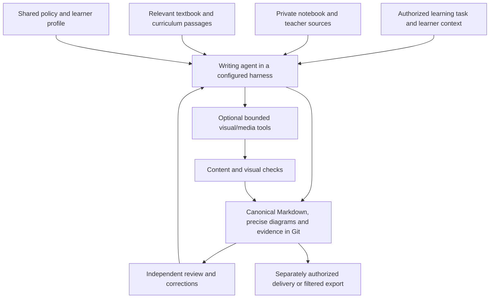

# School-learning system handbook

This handbook explains the complete solution: why its parts exist, how they work together, what is actually configured, how to operate it, and how to rebuild it. It supports learning, fact lookup, future blog writing and installation. It is not only a disaster-recovery runbook. Shared explanations live here; deployment-specific facts and evidence live in private records. Update both when installing or changing a component.

## Find the information you need

| Question | Starting point |
|---|---|
| How does the complete system work? | Architecture and lifecycle below |
| How did the optional legacy bot integration route roles? | [Hermes and bots](hermes-and-bots.md) |
| Which repository skill and capabilities does each role need? | [Task entry points and staged rollout](agent-capabilities.md) |
| How does a notebook become a checked lesson? | [Rule map](../AGENTS.md#rule-map), [operation execution](task-execution.md) |
| How do we avoid repeated setup and false completion? | [Task execution](task-execution.md), [prepared page checks](page-check.md) |
| What is common and what belongs to one learner? | [AGENTS.md](../AGENTS.md), [PROFILE.md](../PROFILE.md), [shared-files.json](../shared-files.json) |
| How do source labels and machine-authorship icons look? | [Note formatting and reusable Markdown examples](note-formatting.md) |
| How do we make images, podcasts, slides and printable notes? | [Media workflows](media-workflows.md), [prompt stages](media-prompts.md), [handoff contract](media-handoff.md) |
| How does Drive authentication and upload work? | [Drive configuration and operations](install-drive.md) |
| How do we rebuild from zero? | [Installation sequence and inventory](install.md) |
| How do precise diagrams run locally or in an agent? | [Visual selection](technical-visuals.md), [runtime installation and execution](install-visual-tools.md), [repository skill](../.agents/skills/learning-visuals/SKILL.md) |
| What was actually installed on our machine? | Private deployment inventory: versions, sanitized configuration, checks and dated change records |
| What can we safely turn into a blog post? | The publishing guidance below, backed by the private experiment records |

## Architecture and the reason for each boundary

The repository supplies shared policy, task entry points and optional local tools. It does not by itself install a chat gateway, scheduler, separate bots, public site or PDF pipeline. Exact deployed capabilities and verification dates belong in the private inventory.

Markdown in Git provides reviewable changes, provenance and a readable learning resource. `sources/` preserves private teaching evidence; `references/` supplies bounded textbook and curriculum context. AGENTS routes common policy, PROFILE holds confirmed learner settings, and adapters such as CLAUDE import those instructions. The shared-file manifest and checker prevent silent policy divergence.

An agent uses the checked-out repository directly with explicitly configured capabilities and authorizations. Repository skills are optional task navigation, not a runtime requirement or security boundary. [Hermes and Discord](hermes-and-bots.md) remain an optional legacy integration, not the mandatory installation path. A bot name never establishes authorization. Learner isolation must be enforced by the configured filesystem and credential boundaries. Optional private Drive media storage reduces Git growth; the uploader checks transfer integrity while the media workflow checks learning quality.

A Pi worker with deterministic Drive/Git polling and a Markdown-preserving public-site/print pipeline is a separate migration direction, not shipped automation. Its input checkpoints, retry rules, publication boundary and infrastructure must be implemented and verified before use; a policy update does not activate it.

## Learning lifecycle

1. Identify the learner and current learning task from trusted context. The notebook/class material sets the lesson's core; curriculum references guide relevant depth rather than adding every available subject.
2. File and hash the source; inspect relevant images directly, including crop limitations and conversion metadata when present. Notebook order takes precedence; otherwise use textbook reference order. Keep an evidence record usable by the next reviewer.
3. Write connected explanations, examples and self-check questions, with visible distinctions between class content and additions. Maintain indexes, provenance and the operation log.
4. Select a visual by its teaching purpose: precise SVG/code for exact technical relationships; a checked generated infographic for a useful overview. A header is decoration, not evidence. Do not replace every SVG or generate paid batches automatically.
   History pages establish time and place in their opening; banner context is optional repetition. Before image generation, choose a visual form from the learning task and content; use topology only when relationships matter. The repertoire includes an explicit OTHER/ELSE path for custom/mixed forms, reuse or no new image. Compare an accepted relevant example and separately check factual accuracy and visual explanation. See [media workflows](media-workflows.md#infographic).
5. For requested media, plan content and prerequisites before generation; check the result and repair only within configured attempt and cost limits. Infographics, presentations, podcasts and printable notes have different narrative structures.
6. Upload accepted artifacts to the recorded learner destination, verify bytes, establish intended-reader access, then publish the versioned link and evidence within the user's Git authorization.
7. Review against the same source versions and actual images/audio. Apply justified corrections, record disagreement or missing evidence, and flag affected derivatives for rechecking.

When asking for clarification or a decision, apply *Ask self-contained, useful questions* in [Wiki workflows](wiki-workflows.md#workflows): supply the context, concrete problem, real alternatives if any, and a recommendation or next step. Keep confirmed facts separate from unknown expectations; reviewers use the same rule. Self-test solutions remain hidden until requested.

## Documentation contract for every change

For a completed step, record: purpose and alternatives; exact version; prerequisite; configuration key/path; installation or change command; resulting behavior; verification and limits; rollback; and links to dependent components. Record the date and whether a statement is observed, user-confirmed, inferred, proposed or unresolved. Never turn a plan into a claimed deployment just by copying it into a guide.

Keep one authoritative home for each fact. Shared mechanisms and generic configuration examples belong in the template and are synchronized through the manifest. Actual channel/folder/user IDs, machine paths, deployment receipts and private review evidence belong in the deployment record. Credentials are referenced by storage location, never copied into either document. The public template stays uninitialized.

## Learning and blog use

A useful article can follow an actual problem through the decision, implementation, check and lesson learned: why Markdown is the durable knowledge layer; why an image description is not a visual check; why a two-speaker podcast needs an accessible opening; why Drive authorization and a folder allowlist are separate; or how lost upload responses are reconciled without duplication. Link the common code and primary documentation, and label experiments as experiments.

Before publishing, derive a separate reviewed article from these records. Remove family details, account/channel/folder IDs, private material, credential locations that reveal infrastructure, and screenshots with personal information. Do not publish the private deployment folder wholesale. No blog publication is authorized by maintaining this handbook.

## Runnable banner and infographic path

The [learning-image execution guide](learning-image-execution.md) is the canonical operational entry: versioned lesson/scope -> reviewed JSON plan -> compiled provider prompt -> one bounded call -> direct visual review -> hash-checked asset -> wiki embed/evidence. `tools/learning_image.py` implements local spending reservations, attempt persistence and review-gated copying. It does not deploy Discord roles or provide OS isolation. The private deployment record distinguishes a successful CLI trial from a live Hermes/Discord run.

## Repository-only execution

Use [optional image setup](install-learning-images.md) and [Drive setup](install-drive.md) directly from a Git checkout. The shared CLI programs and instructions do not depend on global agent skills. Private host inventory and historical rollout experiments are not prerequisites for a new user.
