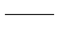

# Mintajegyzet

<!-- PRIVATE-COMMENT-CANARY -->

Egy saját, mesterséges tesztjegyzet. [Téma](tema.md#azonos-cím).

> [!TIP]
> Egy testre ható erő nagysága $F=20\ \mathrm{N}$. 💡 Példa🤖 magyarázata

# Azonos cím

A kémiai alsó index megmarad: H2O. Forrás.[^book]

# Azonos cím

1. Mennyi a kétszerese?

<dl><dd>

 

$2F=40\ \mathrm{N}$.[^book]

  

</dd></dl>

[^book]: Mesterséges tesztforrás, 1. oldal.
